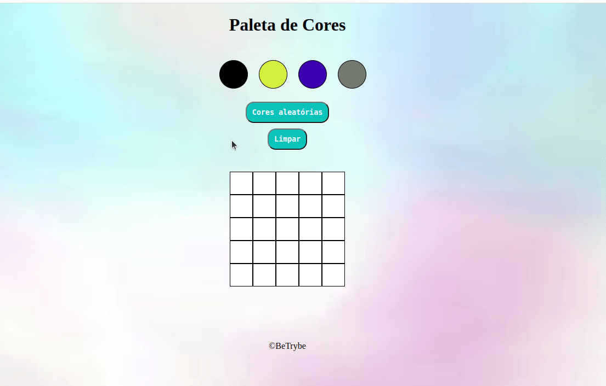

# Project Pixels Art

## Demonstração

## Stacks utílizadas  

   
   
   

### Aprendizados

Projeto "Pixels Arte"

Bem-vindo ao repositório do projeto "Pixels Arte", desenvolvido durante minha jornada na Trybe. Neste projeto, foram aplicados conhecimentos em HTML, CSS e JavaScript para criar uma experiência interativa e criativa.

Descrição do Projeto:
O objetivo do "Pixels Arte" é permitir aos usuários pintar blocos de forma aleatória, escolhendo cores diversas, além de poder limpar a tela quando desejarem. Durante a realização do projeto, foquei em desenvolver a lógica de programação, aplicando funções e utilizando o LocalStorage para melhorar a experiência do usuário.

Recursos utilizados:

HTML: Responsável pela estruturação da página e pela criação dos elementos essenciais para a interação.

CSS: Utilizado para o estilo visual da aplicação, tornando-a atraente e amigável ao usuário.

JavaScript: Responsável pela lógica de programação, permitindo a interação com os blocos e a funcionalidade de escolher cores aleatórias.

# 
Como testar o projeto:
Para testar o "Pixels Arte", basta clonar este repositório em seu ambiente local e abrir o arquivo index.html em seu navegador preferido. A partir daí, você poderá experimentar a interatividade e a diversão que este projeto oferece.
#

Agradeço por conferir este projeto! Sinta-se à vontade para deixar feedback e sugestões. Obrigado por compartilhar essa experiência comigo. Divirta-se com o "Pixels Arte"!

## Autor

[@Christofani](https://github.com/Christofani)
